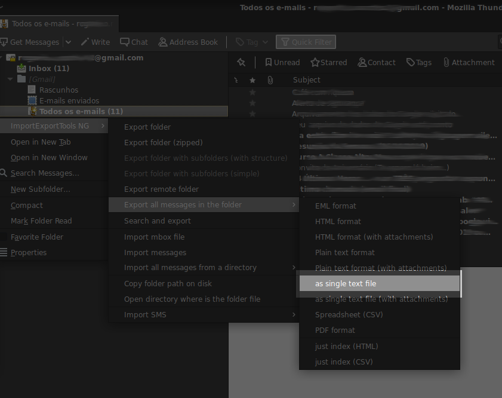

# Gerador de dataset de e-mails
Este script cria um dataset de e-mails para ser usado no modelo de classificação.

Primeiro é necessário exportar as mensagens...

Eu utilizei o gerenciador de e-mails Mozilla Thunderbird juntamente com um add-on ImportExportTools NG

[Exemplo de e-mail gerado]([20151226-Melhore sua organização com a Caixa de entrada do Gmail-3.txt](https://raw.githubusercontent.com/rogeriodeoliveira/create_dataset_emails/master/20151226-Melhore%20sua%20organiza%C3%A7%C3%A3o%20com%20a%20Caixa%20de%20entrada%20do%20Gmail-3.txt?token=AHT6ETPIJ773TYAFRPY3WEK5YC4YA))

Salve os arquivos exportados (.txt) na pasta emails

Você deve alterar as linhas 44,45 e 46 do script para remover seus dados (seu nome) dos e-mails

Execute:
>python3 dataemail.py

O script irá gerar um dataset .cvs